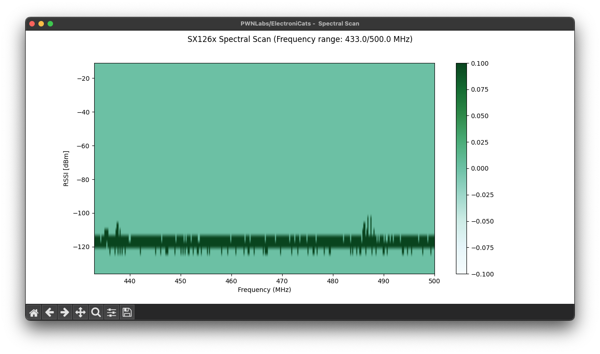

# LoRa-CAD
LoRa Channel Activity Detection.

## Usage
Load the firmware into the RP2040. Once you connect to the board using a serial monitor will start listening for the preamble.
Available commands
```bash
# Available commands are:
set_freq    # Set the frequency in range of 150/960 MHz: Default 903.9
set_sf      # Set the spread factor. Default: 7
set_bw      # Set the bandwith value. Options: (7.8, 10.4, 15.6, 20.8, 31.25, 41.7, 62.5, 125, 250, 500) kHz: Default 250
set_cr      # Set the coding rate. Default: 5
set_sw      # Set the sync Word: Default: 0x34
set_pl      # Set the preamble length: Default: 10
set_op      # Set the output power. Default: 20
get_config  # Show the configuration of the radio
help        # Show help
```
## Example

To test the activity in the selected frequency we use another catsniffer loaded with the `LoRa-CLI` firmware.
Using the next configuration: `freq:915.0, bw:125.0, sf:7, cr:5, syncWord:0x12, power:20, preableLength:8`
So we update the configuration in the `LoRa-CAD` firmware:
```bash
[SX1262] Initializing ... success!
> set_freq 433
Frequency set to 433.00 MHz
> set_sw 12
Sync word set to 0x12
> set_bw 125
Bandwidth set to 125.00 kHz
```
Then running a loop sending `pwnlabs` in the sender board.
```txt
[SX1262] Received packet!
[SX1262] Data:		catsniffer
[SX1262] Freq:		515.00
[SX1262] RSSI:		-108.00 dBm
[SX1262] SNR:		-6.75 dB
[SX1262] Frequency error:	5595.50 Hz
```

> **Note**: The `freq` value are a aproximate frequency.


# LoRa-Freq
## Usage
Load the firmware into the RP2040. The output are like:
```text
FREQ 926.
SCAN 0,0,0,0,0,0,0,0,0,0,0,0,0,0,0,0,0,0,0,0,0,0,0,0,0,0,2031,17,0,0,0,0,0, END
DONE
```

Where the `FREQ` are the value of the current frequency where the firmware take a spectral scan.
The next values are a 33 values where first value are the lowest value and intencity

## Use with Extra Tools
Clone the repo `https://github.com/ElectronicCats/RadioLib` next navigate to `extras/SX126x_Spectrum_Scan`, then install the requirements libraries: `pip install pyserial numpy matplotlib`.
Once you have the libraries, you can run the script.

> By default the firmware and script run in the frequency range of 150 MHz to 960 MHz.

Available commands
```bash 
# Available commands are: 
set_start_freq      # Set the start frequency of the range
set_end_freq        # Set the end frequency of the range
start               # Initialize the scan
stop                # Stop the scan
get_state           # Get if is running
get_config          # Get the radio configuration
help                # Show help
```

Set frequency interval open a serial terminal with `921600` of baudrate and set the frequency range using the commands:
```bash
set_start_freq 433
set_end_freq 500
```
### liveSpectrumScan.py

```bash
usage: liveSpectrumScan.py [-h] [-b BAUDRATE] [--freqStart FREQSTART] [--freqEnd FREQEND] [--offset OFFSET] port

        RadioLib SX126x_Spectrum_Scan plotter script. Displays output from SX126x_Spectrum_Scan example
        as grayscale and

        Depends on pyserial and matplotlib, install by:
        'python3 -m pip install pyserial matplotlib'

        Step-by-step guide on how to use the script:
        1. Upload the SX126x_Spectrum_Scan example to your Arduino board with SX1262 connected.
        2. Run the script with appropriate arguments.
        3. Once the scan is complete, output files will be saved to out/


positional arguments:
  port                  COM port to connect to the device

options:
  -h, --help            show this help message and exit
  -b, --baudrate BAUDRATE
                        COM port baudrate (defaults to 115200)
  --freqStart FREQSTART
                        Starting frequency in MHz (Default to 860)
  --freqEnd FREQEND     End frequency in MHz (Default to 928)
  --offset OFFSET       Default RSSI offset in dBm (defaults to -11)
```

Then execute the python script `liveSpectrumScan.py` using the range `python3 liveSpectrumScan.py SERIAL_PORT --freqStart 433 --freqEnd 500`.




> If your firmware and you frequency range at the python script are'nt the same, then you need to wait until the data collected are in the range of the frequency filter

# LoRa-CLI
LoRa Command Line Interface.

## Usage
Load the firmware into the RP2040. Once you connect to the board using a serial monitor.

```bash
Welcome to the LoRa Sniffer CLI 0.1v

With this sketch you can scan the LoRa spectrum
Changing the Frequency, Spreading Factor, BandWidth or the IQ signals of the radio.
Default parameters:
freq:915.0, bw:125.0, sf:7, cr:5, syncWord:0x12, power:20, preableLength:8
Type help to get the available commands.
Electronic Cats ® 2020
[SX1262] Initializing ... success!
```
Available commands
```bash
# Available commands
# Fw version: 0.1v
	# Configuration commands:
set_rx        # Set the radio in listening mode
set_tx        # Send bytes
set_tx_hex    # Send hex
set_tx_ascii  # Send ascii values
set_chann     # Set channel
set_freq      # Set frequency
set_sf        # Set spreading factor
set_bw        # Set bandwidth
set_cr        # Set coding rate
set_sw        # Set sync word
set_pl        # Set preamble length
set_op        # Set output power
set_inv_iq    # Set invert IQ
# Monitor commands:
get_freq
get_sf
get_bw
get_cr
get_sw
get_pl
get_op
get_config
```

> If you want to use `set_rx` and later you change some radio config, you need to send again `set_rx` to activate

# LoraSniffer

The same base of the `LoRa-CLI` firmware but this is used with `pycatsniffer` to use with wireshark

